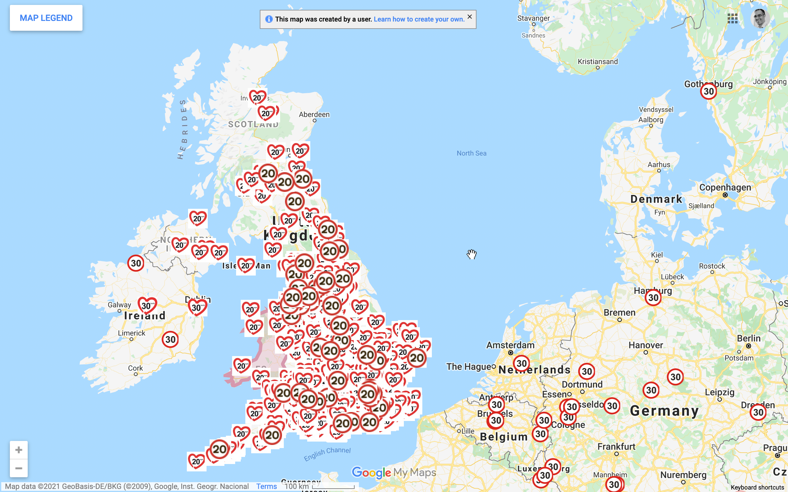

<meta name="twitter:card" content="summary" />
<meta name="twitter:site" content="@20sPlentyWB" />
<meta name="twitter:title" content="20mph has wide support across the UK, not just WB" />
<meta name="twitter:description" content="View blog post." />
<meta name="twitter:image" content="https://schluppeck.github.io/make-wb-20mph/2021/11/07/20mph-has-wide-support-across-the-uk-not-just-wb/twitter-card-01.png" />

More than 70% of people in Britain support 20mph speed limits.[^1] There are many benefits, but three big ones are that it is 
- **healthier**... by encouraging people to hop on the bike or walk on more friendly roads
- **safer**... larger speeds = more accidents and more serious injury
- **cleaner**... there is much less pollution at slower speeds, particularly for stop-and-go accelerating as is common in residential areas

## People in NG support it

There are plenty of places across the UK that are campaigning for 20mph and many, like Nottingham City[^2], have decided to go for it. Interestingly, for the Nottingham crowd, support for 20mph in the city centre was **71%** - very much in line with UK-wide numbers. 

It is hard to imagine support would be any less in West Bridgford and other parts of Nottinghamshire.

## There are many campaigns across the UK (and beyond)

The live view of the map for https://www.20splenty.org/ is here on [google maps](https://www.google.com/maps/d/viewer?mid=1GhiZV47Yy4DYg4Y3jNO_ZMr72Uo&usp=sharing)

**Share and [talk to your councillor](https://www.nottinghamshire.gov.uk/dms/Councillors/tabid/63/ScreenMode/Alphabetical/Default.aspx) to find out if they support it, too.**

[^1]: Tapp, Nancarrow & Davis, 2015 ([paper](https://uwe-repository.worktribe.com/output/844728)), ([news release](https://roadsafetygb.org.uk/news/n-a-6099/))
[^2]: https://www.transportnottingham.com/consultations/city-centre-20-mph/