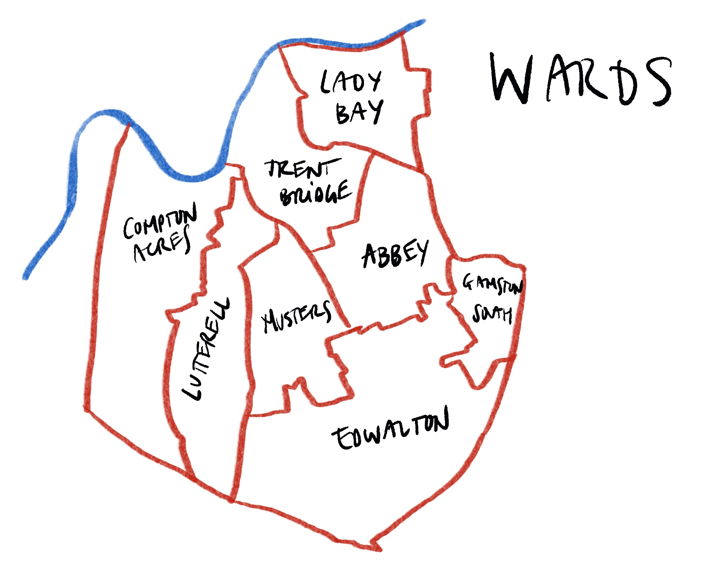

<meta name="twitter:card" content="summary" />
<meta name="twitter:site" content="@20sPlentyWB" />
<meta name="twitter:title" content="Easily contact your councillor..." />
<meta name="twitter:description" content="Use this map to send an e-mail to your local councillor. E-mail addresses and some suggestions for what to write included. It will take you less than a minute..." />
<meta name="twitter:image" content="https://schluppeck.github.io/make-wb-20mph/2021/11/10/let-your-councillor-know-that-20-s-plenty/twitter-card-02.png" />

Click on your ward on the map below to get a ready-made e-mail that you can send to your local councillor **to show support for 20mph** across West Bridgford.

**Update (2021-11-11, 6pm):** (County) Cllr Penny Gowland is now cc'ed on the messages automatically.

When you click on the map, your e-mail programme should pop up with some pre-prepared text and the correct e-mail addresses for the councillors in your ward. (**Any problems, please let me know**).

If you prefer to copy and paste bits and pieces of the template or to write your own text, [scroll down for where to find](#details) details about your ward, councillors and more.

<!-- Image Map Generated by http://www.image-map.net/ -->

<map name="image-map">
    <area  tabindex=1 alt="lady bay" title="lady bay" title="lady_bay" id="lady_bay" href="" coords="711,126,749,209,746,284,770,329,870,326,998,381,981,282,1019,260,1020,175,973,147,966,97,863,132,781,129,738,118" shape="poly">
    <area  tabindex=2 alt="trent bridge" title="trent bridge" id="trent_bridge"
    href="" coords="667,138,610,240,559,375,610,407,621,458,664,504,755,587,794,581,794,537,853,513,891,378,818,360,746,360,714,293,718,235,688,172" shape="poly">
    <area target="" alt="abbey" title="abbey" href="" id ="abbey" coords="913,384,876,531,806,560,809,592,765,609,852,791,922,780,1011,760,1027,726,1042,682,1075,709,1083,659,1095,616,1031,431" shape="poly">
    <area target="" alt="compton acres" title="compton acres" href=""
    id="compton_acres"coords="316,314,240,678,222,992,448,1138,436,1076,399,964,422,786,401,754,466,739,477,709,498,698,498,606,507,568,535,504,571,439,583,408,544,396,460,434,384,386,345,335" shape="poly">
    <area target="" alt="lutterell" title="lutterell" id="lutterell" href = "" coords="591,442,556,501,522,577,507,682,494,720,487,732,433,765,445,786,412,965,449,1063,465,1154,565,1205,607,946,607,809,582,651,639,603,671,575,671,540,617,507" shape="poly">
    <area target="" alt="musters" title="musters" id="musters" href="" coords="680,545,679,589,597,653,615,785,621,940,609,1002,689,993,692,937,729,924,767,975,850,959,791,827,849,801,765,639,711,559" shape="poly">
    <area target="" alt="edwalton" title="edwalton" id="edwalton" href="" coords="811,830,861,956,773,979,729,938,702,944,705,999,610,1014,592,1120,572,1220,753,1272,899,1324,1112,1145,1194,1000,1238,879,1206,877,1157,943,1115,882,1078,891,1075,874,1150,827,1083,720,1049,698,1046,733,1028,739,1036,767" shape="poly">
    <area target="" alt="gamston_south" title="gamston_south" id="gamston_south" href = "" coords="1199,628,1270,657,1246,857,1202,875,1163,929,1107,865,1161,828,1103,734,1108,708,1098,642" shape="poly">
</map>

<h2 id="details">Some details</h2>

- [Your Councillors by Ward](https://democracy.rushcliffe.gov.uk/mgMemberIndex.aspx?FN=WARD&VW=LIST&PIC=0)
- [Consituency map](https://www.rushcliffe.gov.uk/media/1rushcliffe/media/documents/pdf/councilanddemocracy/elections/ConstituencyMap%202015.pdf) - which ward am I actually in?

### The email  reads:

>Will you please support 20mph for West Bridgford
>
>Dear councillors,
>I am writing to ask you if you will support a default speed limit of 20mph where people walk, live and play. As you probably know, there is overwhelming support for the idea of having 20mph as a default speed limit, especially in densely populated and residential areas like West Bridgford, so it is likely to be hugely popular with your constituents, maybe especially the many parents with young children.
>
>
>There is a short video briefing by the organisation Twenty is Plenty for Us that explains the many benefits and how local councils can help effect this change: https://www.20splenty.org/parish_council_motion.
>
>I would appreciate hearing your views on this topic and helping us push for this big improvement in quality of life in your ward and across Rushcliffe.
>
>Sincerely

