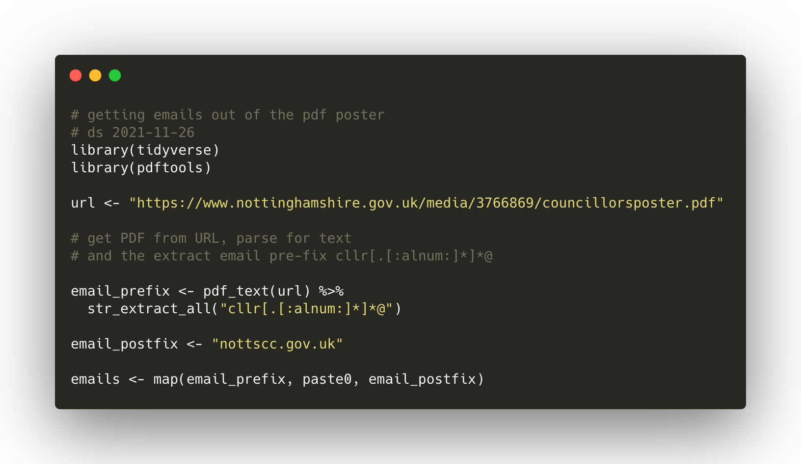

The Nottinghamshire county council webpage has a lot of detail about what it does and what people's roles are. However, I found getting hold of e-mail addresses (if you want more than 1 at a time) a bit hard. 

So I used a bit of code/magic to extract the emails for the 2021-2025 <a href="https://www.nottinghamshire.gov.uk/">Nottingham county</a> councillors: 

The <a href="./2021-nottscc-emails.csv">list of email addresses</a> in text / CSV format is easier to handle.

Use it responsibly, please.