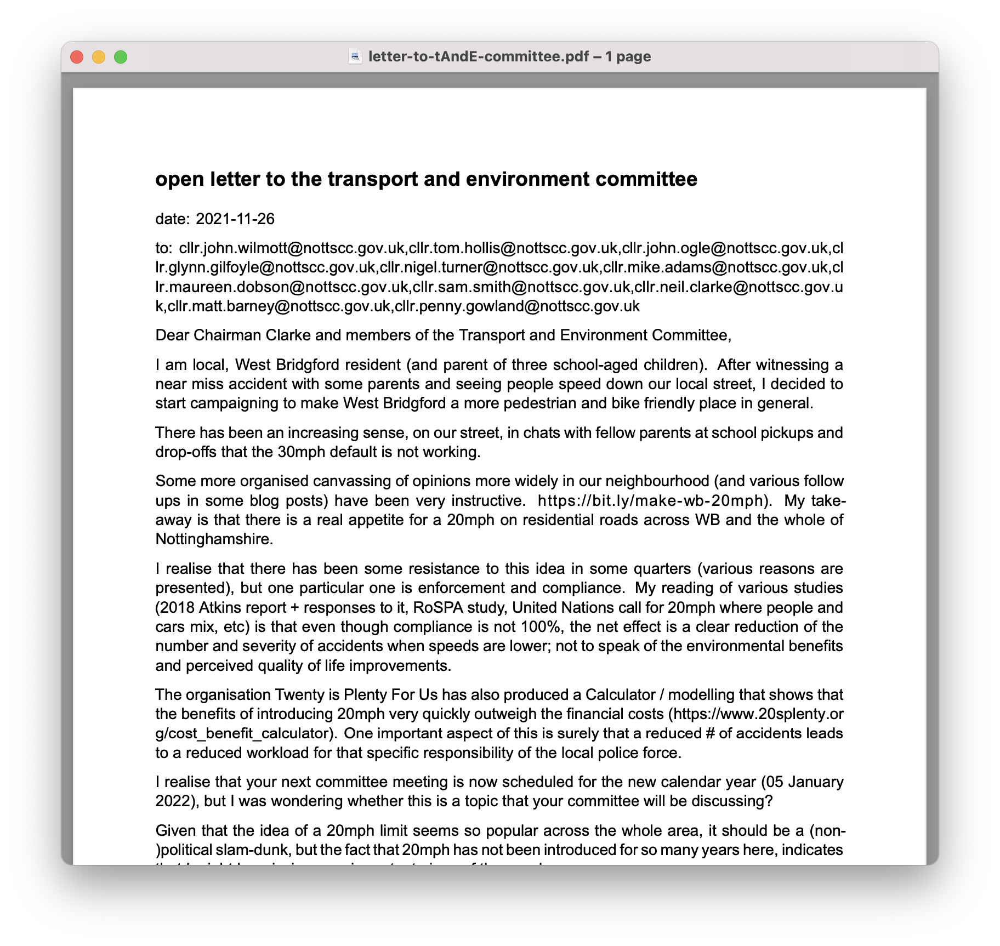

## many items on Notts CC agenda

... which means that the petition (and motion) to consider 20mph default speed limit couldn't be discussed. Tweet from Cllr Penny Gowland:

<blockquote class="twitter-tweet">
Still didn&#39;t get to discuss 20s plenty <a href="https://twitter.com/schluppeck?ref_src=twsrc%5Etfw">@schluppeck</a> .. 4th time lucky
&mdash; Penny Gowland (@Penny_Gowland) <a href="https://twitter.com/Penny_Gowland/status/1463958750520348679?ref_src=twsrc%5Etfw">November 25, 2021</a></blockquote> 

But things don't happen instantly - and so I have decided to be constructive with the extra time and to write to the <a href="https://www.nottinghamshire.gov.uk/dms/Committees/tabid/62/ctl/ViewCMIS_CommitteeDetails/mid/381/id/536/Default.aspx">Transport & Environment Committee</a> of the Nottinghamshire CC in the meantime. Their next meeting is early in 2022 (5 Jan) and I thought it would be great to find out their views in the run-up to that meeting and the next full council meeting...

<figure>

<figcaption>Click to read PDF</figcaption>
</figure>

If you want to write to them, too, the chairman is Neil Clarke, MBE (cllr.neil.clarke@nottscc.gov.uk) or you can copy  the e-mail addresses for all the members of the committe by clicking here and pasting them into your preferred e-mail program.

<button onclick="myFunction()">Copy list of e-mail addresses</button>

cllr.john.wilmott@nottscc.gov.uk, cllr.tom.hollis@nottscc.gov.uk, cllr.john.ogle@nottscc.gov.uk, cllr.glynn.gilfoyle@nottscc.gov.uk, cllr.nigel.turner@nottscc.gov.uk, cllr.mike.adams@nottscc.gov.uk, cllr.maureen.dobson@nottscc.gov.uk, cllr.sam.smith@nottscc.gov.uk, cllr.neil.clarke@nottscc.gov.uk, cllr.matt.barney@nottscc.gov.uk, cllr.penny.gowland@nottscc.gov.uk

