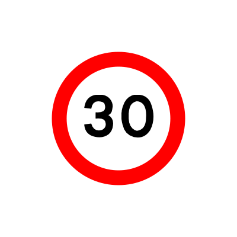

Happy new year, with the hope that 2022 may be less messed up than the previous 2 years. First and foremost with less COVID-19 and more good health for everyone. 

Interesting times ahead, as a motion on 20mph in residential areas is on the agenda at the full county council meeting on Thursday 20 Jan 2022.

At this stage, the discussion *is not quite about adopting the 20mph limit wholesale*, but whether to task the Transport & Environment Committee *"with exploring the feasibility of implementing a 20MPH speed limit on residential roads"*. 

I think this would be a great step in the right direction! Importantly, having a group of people with interest and expertise evaluate proposals will allow for discussion about what constituents like as well as dislike. Other ideas to make our neighbourhoods more pedestrian and bike friendly will also be on their radar.

Very notable: the motion has cross-party support. It is signed by both Councillor Penny Gowland Councillor Neil Clarke MBE (who is also the chair of that committee).

## County Council debates 20mph

*"This Council recognises the evidence base that exists demonstrating the significant health and safety benefits to the public from a reduction in vehicle speed to 20MPH.*

*...*

*This Council resolves therefore to task the Transport and
Environment Committee with exploring the feasibility of implementing a 20MPH speed limit on residential roads and any other new measures that could help improve road safety in all its residential conurbations."*

[From the 2022-01-20 full council agenda](https://www.nottinghamshire.gov.uk/DMS/Document.ashx?czJKcaeAi5tUFL1DTL2UE4zNRBcoShgo=j0p3zYrOiX%2b6GIk8TF0qasUbJGUGA4A5Z7GzQOJIoTeV1I0r4r3SHg%3d%3d&rUzwRPf%2bZ3zd4E7Ikn8Lyw%3d%3d=pwRE6AGJFLDNlh225F5QMaQWCtPHwdhUfCZ%2fLUQzgA2uL5jNRG4jdQ%3d%3d&mCTIbCubSFfXsDGW9IXnlg%3d%3d=hFflUdN3100%3d&kCx1AnS9%2fpWZQ40DXFvdEw%3d%3d=hFflUdN3100%3d&uJovDxwdjMPoYv%2bAJvYtyA%3d%3d=ctNJFf55vVA%3d&FgPlIEJYlotS%2bYGoBi5olA%3d%3d=NHdURQburHA%3d&d9Qjj0ag1Pd993jsyOJqFvmyB7X0CSQK=ctNJFf55vVA%3d&WGewmoAfeNR9xqBux0r1Q8Za60lavYmz=ctNJFf55vVA%3d&WGewmoAfeNQ16B2MHuCpMRKZMwaG1PaO=ctNJFf55vVA%3d)

If you want to see the presentation and discussions live or after the meeting, check out [this link on youtube](https://www.youtube.com/watch?v=81bd59UF_Ow)

Looking at previous council meetings, motions are introduced quite late in the agenda... or get plenty of tea and biscuits if you want to watch the whole thing. (It's kind of instructive to see the council at work!)

## Notes

- Documents for the [2022-01-20 meeting](https://www.nottinghamshire.gov.uk/dms/Meetings/tabid/70/ctl/ViewMeetingPublic/mid/397/Meeting/5577/Committee/513/SelectedTab/Documents/Default.aspx)  (including agenda, motions) 

- Transport and Environment Cmtte [recording of meeting 2022-01-05](https://www.youtube.com/watch?v=K6BZwsLutvM)

- the little animation of the speed sign above is made in code (with apologies if the proportions of the red ring aren't 100% correct)
- if you are interested in a hit of *font* trivia... I found the ``Transport`` fonts for the distinctive lettering on [this webpage](https://www.roads.org.uk/fonts)

