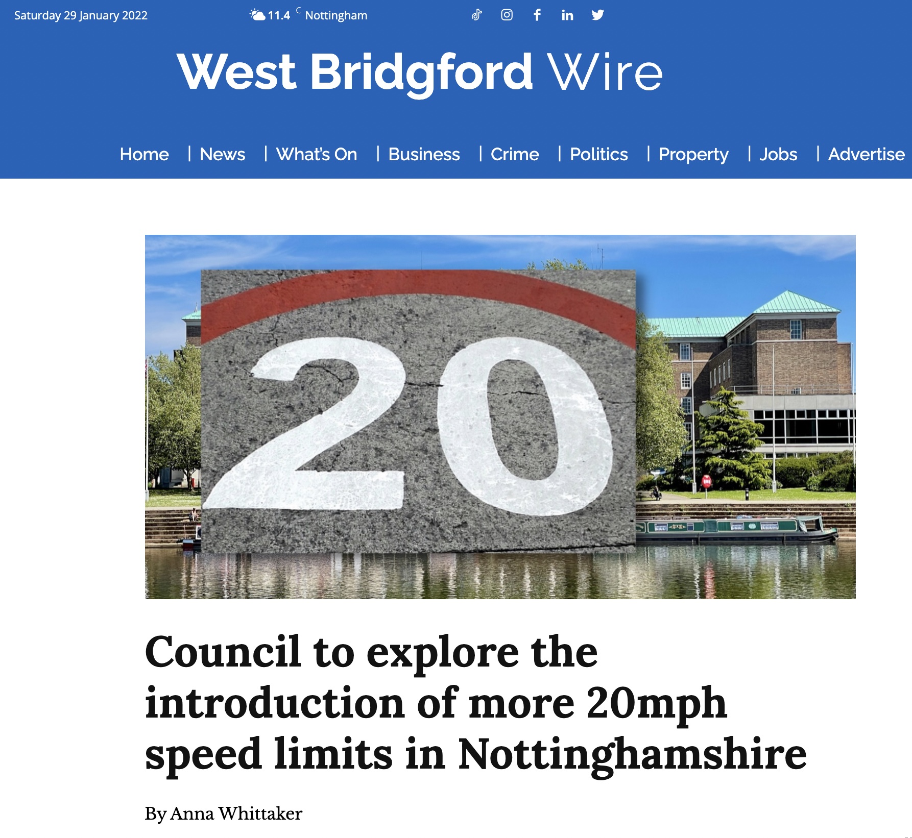
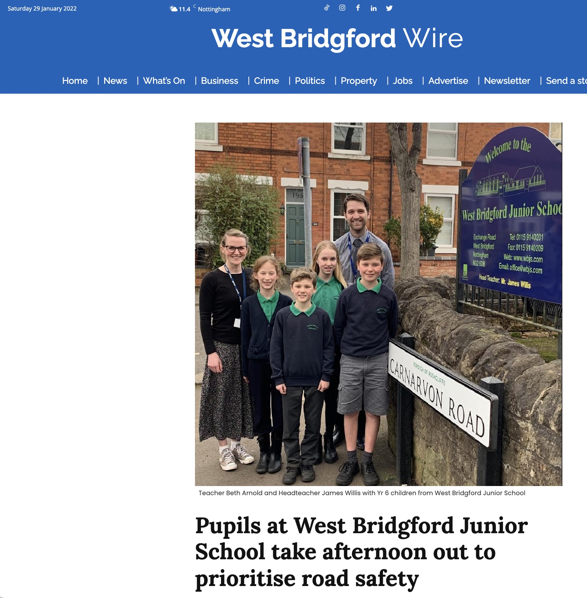

Great news about efforts to make the roads in our neighbourhoods safer and more attractive for walking, running, cycling, and generally being active.

Nottinghamshire county council has voted unanimously in support of a motion to explore 20mph in residential areas across Nottinghamshire (see also [coverage on the local news](https://westbridgfordwire.com/council-to-explore-the-introduction-of-more-20mph-speed-limits-in-nottinghamshire/)). While "exploring 20mph" may sound like hedging, I personally think that the buy-in and support on show from all sides (across party affiliations) is an important step in the right direction.  

But the statement from the Transport and Environment Committee chairman sounds like this won't be a slam dunk... so it's important to keep making the case that **20's plenty** for us here.

## Students, teachers and parents are also getting involved

Students and teachers at West Bridgford Junior School picked up on the idea of road safety as part of a **Community Ambassador** scheme. This scheme has been set up by Mrs Arnold, one of the year 6 teachers. The aim is to encourage students at the school to engage with the local community. She told the local *West Bridgford Wire*:

>"“It’s really important to us as a school to get more involved in the community locally, and this year we’re getting started with our ‘Community hub’ which will see a series of exciting events out and about in West Bridgford.
>
>“... we felt it was vital to talk about road safety and awareness with our children, as many already walk to school over some pretty busy roads."

One of the activities on their *road safety day* was to design a poster to raise awareness about speeding and the benefits of slowing things down to 20mph. **Watch this space!** - 🎨😀

## Links to local news

