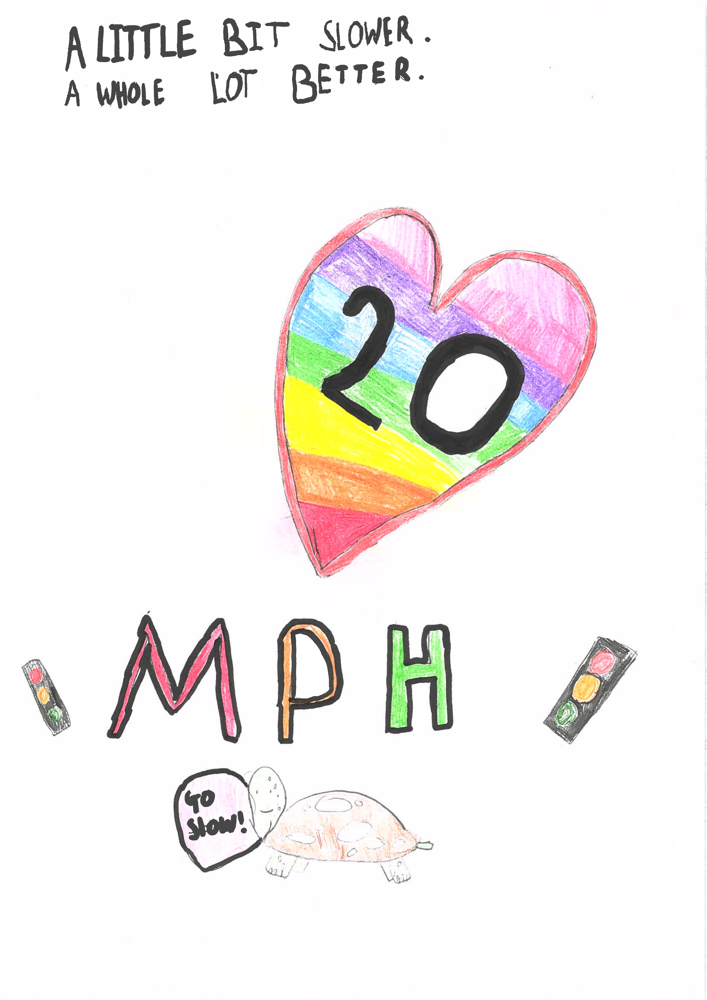
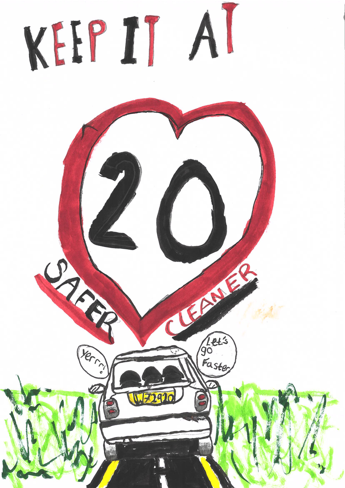
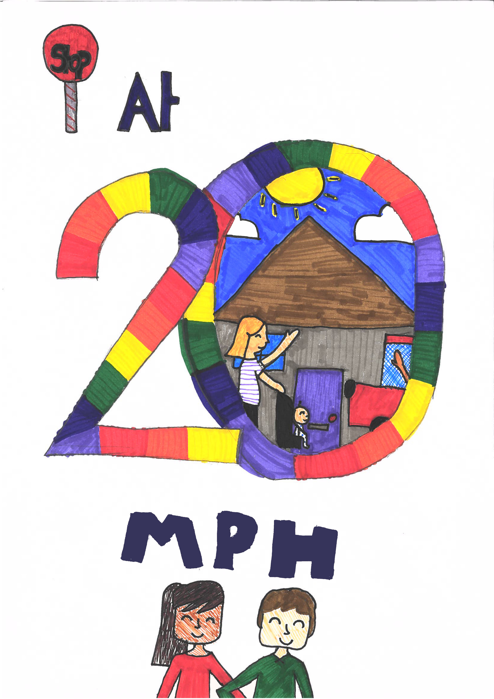
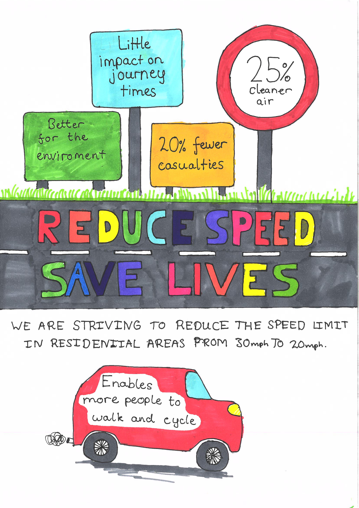

In amazing effort, the students at the West Bridgford Junior School have put their creativity into designing *posters* to make people think about slowing down!

Mrs Arnold and the Community Hub Team at the school organised an art competition and got *an amazing response* across all year groups.

You can see all the art work at <a href="https://wbjs-art.netlify.app/" target=_new>https://wbjs-art.netlify.app/</a>

The four winning entries (after intense voting) were:

Look out for giant versions of them around the school!

