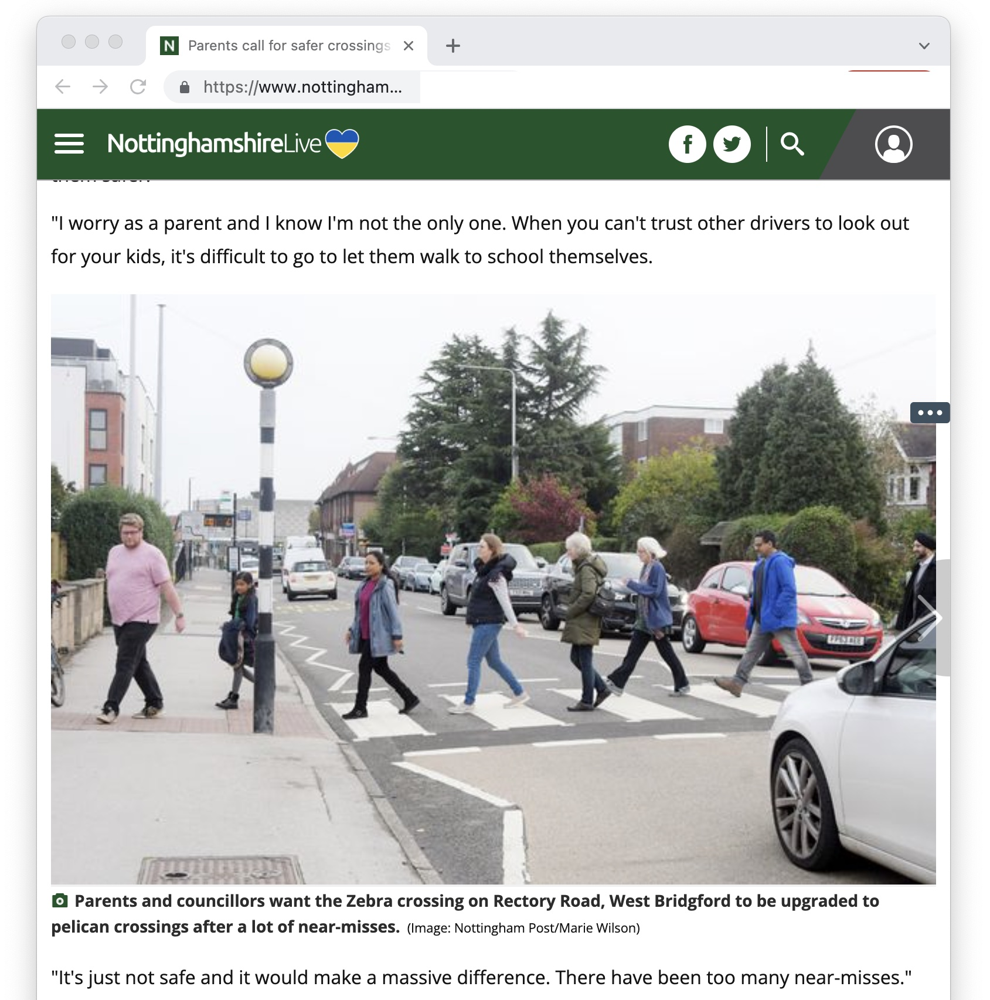

## Good news! 

A zebra crossing on Rectory Road that has been the site of many near-misses, some involving school-age children, is slated to get a major upgrade. According to a message from Cllr Penny Gowland, [Via East Midlands](https://www.nottinghamshire.gov.uk/transport/roads/via) has agreed to "build out" the zebra crossing. This will make pedestrians more visble to road users and encourage drivers and cyclists to slow down. (Via East Midlands is the county-council owned civil engineering company that deals with road improvements for the council).

Read more about local campaigning by Jat, Meena and other parents that started with [this facebook post](https://www.facebook.com/groups/482435302625192/permalink/1071026070432776/) and some [related coverage in local news](https://www.nottinghampost.com/news/local-news/parents-call-safer-crossings-near-6054518).

